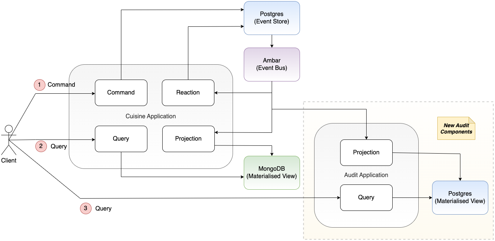

# Audit Service for Event Sourcing with Ambar Demo

This repository contains an audit service Spring Boot application for capturing cookery club membership status changes.

It is used in conjunction with the Ambar event sourcing demo in the repository:

https://github.com/lydtechconsulting/ambar-event-sourcing

## Application Overview

The application provides an endpoint to receive notifications of membership submissions and evaluations, and writes the associated status updates to a Postgres materialised view.  This database can then be queried via the application's REST API.



## Running the Application 

Build the application (with Java 21), build its docker container, and start along with a Postgres database instance:

```
mvn clean install
docker build -t ambar-audit-service .
docker-compose up -d
```

To test this, send a REST request for a Cooking Club Membership Application Submitted event.  The HTTP request body must match the JSON structure generated by Ambar.  For example:
```
curl -X POST http://localhost:8099/api/v1/audit/cooking-club/membership/projection \
  -H "Content-Type: application/json" \
  -d '{
    "data_source_id": "postgres_source",
    "data_source_description": "Events Table in Postgres",
    "data_destination_id": "Audit_CookingClub_Membership",
    "data_destination_description": "Audit_CookingClub_Membership",
    "payload": {
        "id": 7,
        "event_id": "R47DJgvy0ejRNcj5uPH7JFv0dSQfcwK5aGrKfkPItjUNDmhXZpArhUBf",
        "aggregate_id": "Sz5vzKng0QgdlI4KYjG9zBnyKLVas0LXtOOcPLMgPndJXbWCK0oEhTR0",
        "causation_id": "R47DJgvy0ejRNcj5uPH7JFv0dSQfcwK5aGrKfkPItjUNDmhXZpArhUBf",
        "correlation_id": "R47DJgvy0ejRNcj5uPH7JFv0dSQfcwK5aGrKfkPItjUNDmhXZpArhUBf",
        "aggregate_version": 1,
        "json_payload": "{\"firstName\": \"Julian\", \"lastName\": \"Sanchez\", \"favoriteCuisine\": \"Mexican\", \"yearsOfProfessionalExperience\": 0, \"numberOfCookingBooksRead\": 0}",
        "json_metadata": "{}",
        "recorded_on": "2025-01-18T14:36:01.129575",
        "event_name": "CookingClub_Membership_ApplicationSubmitted"
    }
}'
```

Query the materialised view to see the audited event:
```
curl http://localhost:8099/api/v1/audit/cooking-club/membership/query/list
```

The response contains the audited membership status:
```
[{"name":"Julian Sanchez","status":"Requested","createdAt":"2025-01-18T21:57:14.645650Z","lastUpdatedAt":"2025-01-18T21:57:14.645650Z"}]
```
## Event Sourcing with Ambar Demo

The demo adds this new service to an existing deployment that already has historic events stored in the event store.  It demonstrates that those events are delivered to the new application when the Ambar emulator is restarted.

The steps to run the demo are in the `ambar-event-sourcing` project [Readme](https://github.com/lydtechconsulting/ambar-event-sourcing/blob/main/README.md) file.
